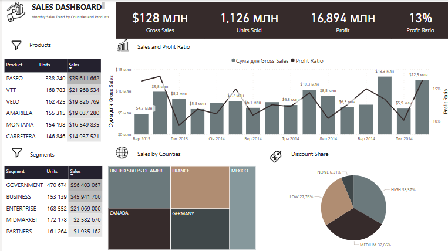

# 📊 Sales Dashboard — Power BI Проєкт

## 🔍 Опис
Цей Power BI дашборд створений для візуального аналізу продажів за країнами, продуктами та сегментами клієнтів. Основна мета — надати ключову інформацію для прийняття бізнес-рішень на основі агрегованих даних про продажі, прибутки та знижки.

## 🎯 Основні функції
- **Зведені KPI**:
  - Загальні продажі (Gross Sales)
  - Кількість проданих одиниць (Units Sold)
  - Прибуток (Profit)
  - Рентабельність (Profit Ratio)

- **Динаміка продажів**:
  - Графік з лінією рентабельності та стовпцями загальних продажів за місяцями.

- **Продажі за продуктами**:
  - Таблиця з деталізацією по найменуванню, кількості проданих одиниць і сумою продажів.

- **Продажі за сегментами**:
  - Таблиця з розподілом продажів за типами клієнтів (Government, Business, Partners тощо).

- **Географічна аналітика**:
  - Візуалізація продажів за країнами у вигляді карт-схеми (tree map).

- **Знижки**:
  - Кругова діаграма частки продажів із знижками (None, Low, Medium, High).

## 📌 Технології
- **Power BI Desktop**
- DAX (для обчислення KPI: рентабельність, знижки)
- Зведені таблиці та фільтри
- Умовне форматування

## 📂 Джерела даних
- Дані імпортовані з Excel (імітаційний набір даних з інформацією про транзакції, клієнтів, знижки та продукти).

## ⚙️ Використання
1. Відкрийте файл `SalesDashboard.pbix` у Power BI Desktop.
2. Оновіть джерела даних за потреби (або підключіть свій Excel-файл).
3. Перегляньте дашборд, використовуючи фільтри та інтерактивні графіки.

## 💡 Призначення
Цей дашборд може бути використаний:
- Бізнес-аналітиками для презентації звітів керівництву.
- В якості навчального прикладу в курсах Power BI або бізнес-аналітики.
- Для моніторингу ефективності продажів у реальному часі.

